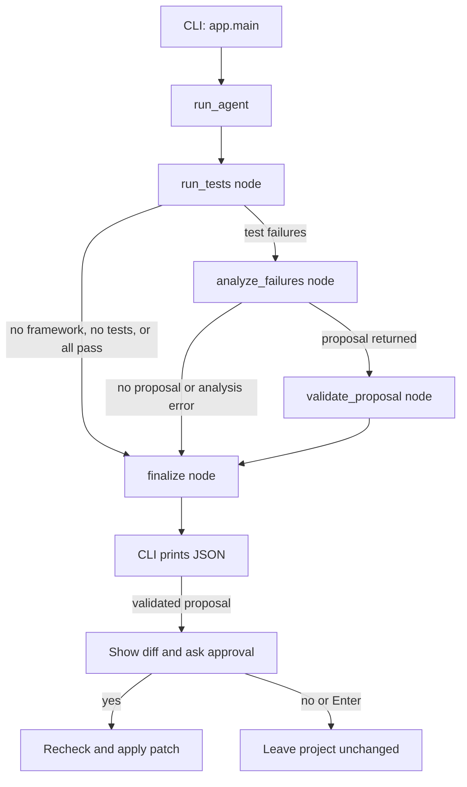

# Project Walkthrough

This document follows one run from the command line to the final result. The agent is deliberately deterministic about test execution and policy checks; the language model is used only to interpret failures and suggest a change.

## Big Picture

The boxes are LangGraph nodes. The arrows are graph edges. The labeled arrows are conditional edges: they choose a route based on values in the current state.

## Starting the Program: `app/app.py`

Run the app from the repository root with `python -m app.app`. Python imports the `app` package and runs its `app.py` module as a script. The last lines call `main()` only in this command-line case; importing the module for a test does not start the CLI.

`main()` is the command-line boundary:

1. `argparse.ArgumentParser` defines the `--project-path` option. If omitted, it points to the bundled Python demo.
2. `parse_args()` reads what the user typed and returns the selected path.
3. `Path(...).resolve()` turns that path into an absolute path. The directory check stops early with a useful command-line error if it does not exist.
4. `load_dotenv(...)` loads settings from the repository `.env` file. The API key is not required just to run tests; it is needed only if the graph reaches LLM analysis after failures.
5. `run_agent(...)` executes the QA workflow and returns a JSON string. `json.loads(...)` converts that string into a Python dictionary so the CLI can inspect it.
6. The CLI checks that the status is `proposal_reviewed` and that every framework reports `validation_passed: true`. Only then does it show the unified diff and ask for a decision.
7. A `y` or `yes` calls `apply_approved_patch(...)`. Any other answer, including Enter, rejects the proposal. `EOFError` is treated as rejection so a closed/non-interactive input stream cannot approve a change accidentally.
8. Finally, `json.dumps(..., indent=2)` prints the full result in readable JSON.

The CLI is kept separate from the agent logic: later a Streamlit interface can call `run_agent` and present the same result without needing to copy test-running or analysis behavior.

## The LangGraph State: `agent/state.py`

`AgentState` is the shared dictionary passed between graph nodes. It carries:

- `project_path`: which project the agent is inspecting.
- `framework_results`: discovered test frameworks and each test's exit code.
- `failed_tests`: failing test information and bounded output used for diagnosis.
- `status`, `summary`, `proposal`, and `decisions`: workflow progress and analysis results.
- `result`: the final JSON string returned by `run_agent`.

The state is data, not a class instance with behavior. A node reads the fields it needs and returns a dictionary containing only the fields it changes. LangGraph merges those updates into the state for the next node.

## Graph Nodes and Edges: `agent/agent.py`

`_build_agent_graph()` creates and compiles the workflow:

- `START -> run_tests` is the entry edge.
- `_run_tests_node` calls `_run_tests` and records test results. `_route_after_tests` sends projects with failures to `analyze_failures`; projects with no supported framework, no tests, or all passing tests go straight to `finalize`.
- `_analyze_failures_node` gathers bounded source context and calls `_analyze_failures`. That function uses `ChatGroq` with a structured Pydantic response, so the expected response has a summary and at most one proposal. Errors become an `analysis_failed` result rather than crashing the CLI.
- `_route_after_analysis` sends a returned proposal to `validate_proposal`. If there is no proposal or analysis failed, it skips validation and goes to `finalize`.
- `_validate_proposal_node` checks the proposal separately for each detected framework by calling `evaluate_patch_proposal`. Validation runs the proposed replacement in a temporary copy and does not alter the selected project.
- `_finalize_node` builds the consistent public JSON shape. `finalize -> END` completes the graph.

`run_agent(project_path)` is intentionally small: it invokes the compiled graph with the initial path and returns the `result` field. The graph is compiled once at module load and can be invoked for each project run.

## Running Tests: `frameworks/`

`agent/tools.py` detects framework markers in a project. `FactoryFramework` maps the framework name to an adapter:

- `PytestAdapter` finds `tests/test_*.py`, launches pytest using the current Python interpreter, and captures output.
- `JestAdapter` finds supported Jest filename patterns and invokes the project's already-installed local Jest. It intentionally refuses to fetch dependencies during validation.

Both adapters implement the `TestFramework` contract in `frameworks/base.py`. This lets `_run_tests` use either framework through the same methods instead of embedding framework-specific subprocess logic in the graph.

`_run_tests` stores exit codes for every discovered test. A zero exit code means pass; a nonzero code means failure. Output is retained for failed tests, with a size limit so a large log cannot overwhelm the LLM context.

## Patch Guardrails: `agent/guardrails.py`

`evaluate_patch_proposal` is the trust boundary for suggestions. It rejects paths outside the project, protected files, test files, invalid policy, stale or ambiguous original text, and paths classified as both normal and business-sensitive. Unclassified paths are suggestion-only. Eligible changes are applied to a temporary project copy and all its discovered tests must pass. Even then, the result requires human approval.

After approval, `apply_approved_patch` rechecks policy eligibility and verifies that the original text still occurs exactly once before writing. This avoids blindly overwriting a target that changed after the proposal was generated. It modifies only the proposed target file; it never edits tests or policy files.

## Tests and Demos

The root `test_*.py` files test the agent itself. Run them with `python -m pytest`. `pytest.ini` excludes `workspace/` so demo-project tests are not accidentally collected as agent tests.

The projects under `workspace/` are input examples for the agent. Run the Python demo with `python -m app.app --project-path workspace/demo-project`. The demo itself has tests inside its own `tests/` folder, which the agent discovers and runs.

`test_agent_workflow.py` checks orchestration outcomes, including that passing tests skip LLM analysis and that approval/rejection in the CLI changes or preserves the target as expected. `test_guardrails.py` checks the path policy and temporary-copy validation. `test_jest_adapter.py` is currently a small adapter demonstration script, not a pytest test function.

## Practical Deployment Notes

The CLI is suitable for local learning. A hosted web app should not accept arbitrary project paths from remote users: run uploaded projects in isolated, resource-limited workers, impose timeouts and size limits, and treat project files and test output as untrusted input. Store `GROQ_API_KEY` in the host's secret manager, not in source control. A Streamlit UI can be a thin layer over the existing workflow, but it should keep the explicit diff review and approval gate.